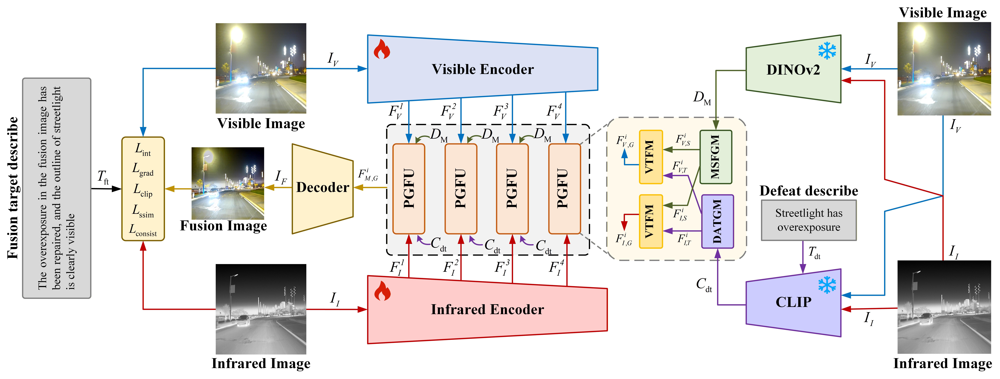
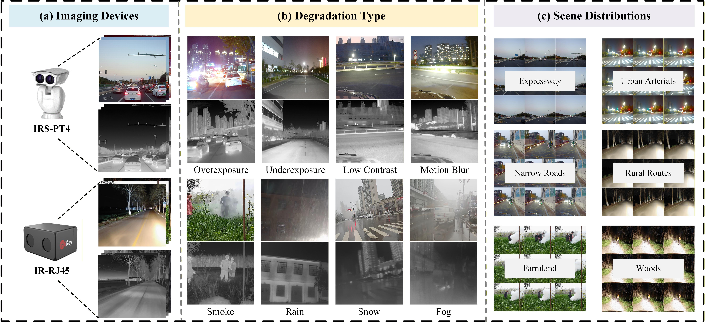

# SGDAFusion: Semantic Prior Guided Degradation-Aware Network for Infrared-Visible Image Fusion

> **Information Fusion 2026**  
> Guanghui Yue, Zhirong Yao, Cheng Zhao, Weiqing Yan, Bin Jiang, Tianwei Zhou*  
> [(Paper)]

---

<div align="center">
  
  <p align="center">
    <em>Fig 1: SGDAFusion network。</em>
  </p>
</div>

---

## 1. Create Environment
- Create Conda Environment

```bash
conda create -n SGDAFusion python=3.10.13
conda activate SGDAFusion
```

- Install Dependencies

```bash
pip install -r requirements.yml
```

## 2. Prepare Your Dataset
---
<div align="center">
  
  <p align="center">
    <em>Fig 1: DA-IVIF</em>
  </p>
</div>

---

You can also refer to this format to prepare your data. You should list your dataset as followed rule:
```bash
    dataset/
        your_dataset/
              train/
                  vis/
                  ir/
              eval/
                  vis/
                  ir/
              train.csv
              test.csv

```

## 3. Training your model
```bash
python train.py --gpu 1 --config training.yml
```

## 4. Test
```bash
python test.py
```

## 5. DA-IVIF
- [Google Drive](你的谷歌云盘链接)
- [Baidu Yun](https://pan.baidu.com/s/15m9PJEejmfeukk-oYnx42w?pwd=DA26) 提取码: DA26


## 6. Citation
If you find our work or dataset useful for your research, please cite our paper.
